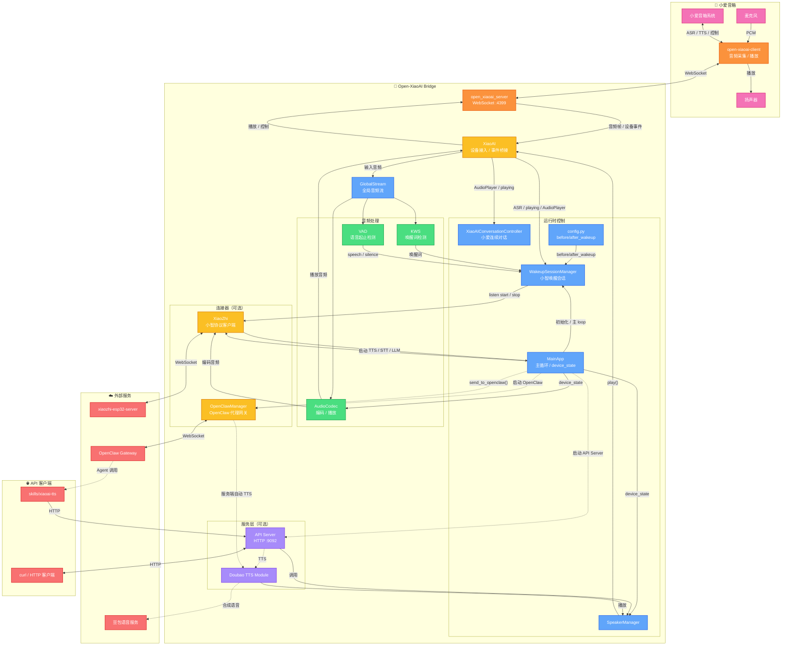

# Open-XiaoAI Bridge

小爱音箱与外部 AI 服务（小智 AI、OpenClaw 等）的桥接器。

打破小爱音箱的封闭生态，灵活接入多种 AI 服务（小智 AI、OpenClaw 或自定义 Agent），提供 HTTP API 实现远程控制。致力于成为智能音箱与 AI 服务之间的标准桥接层。

> 本项目由 [Open-XiaoAI](https://github.com/idootop/open-xiaoai) 的 `examples/xiaozhi/` 演进而来，在保留小智 AI 接入能力的基础上，新增 OpenClaw 集成、HTTP API Server 等功能，已成为独立项目发展。

**演示视频：** <https://www.bilibili.com/video/BV1DHcBz1Ex7>

## 功能特性

- 🦞 **OpenClaw 集成** — 接入 [OpenClaw](https://github.com/openclaw/openclaw)，支持豆包 TTS 播放回复，Agent 可通过 SKILL 自由选择音色
- 🤖 **小智 AI 集成** — 接入 [xiaozhi-esp32-server](https://github.com/xinnan-tech/xiaozhi-esp32-server)
- 🎙️ **自定义唤醒词** — 支持中英文，可设置多个 (目前只支持小智)
- 💬 **连续对话 & 随时打断** — 多轮对话无需反复唤醒 (目前只支持小智和原生小爱)
- ⚡ **VAD + KWS 唤醒** — 语音活动检测前置，减少不必要的关键词识别，更省电
- 🌐 **HTTP API 远程控制** — 支持远程播放文字/音频及控制音箱
- 🧩 **模块化设计** — 各功能独立开关，按需启用

## 系统架构



### 工作流程说明

1. **小智唤醒与对话链路**
   ```
   麦克风 → open-xiaoai-client → open_xiaoai_server → XiaoAI → GlobalStream
   → KWS 或小爱 ASR → WakeupSessionManager → before_wakeup()
   → VAD 等待 speech / silence → XiaoZhi(start/stop listening)
   → MainApp 切换 LISTENING / SPEAKING → AudioCodec 编码 / 播放
   → xiaozhi-esp32-server
   ```
2. **小爱连续对话**
   ```
   小爱 ASR / AudioPlayer / playing 事件
   → XiaoAI → XiaoAIConversationController
   → 决定是否继续唤醒小爱或退出小爱连续对话
   ```
   > 小爱连续对话和小智唤醒会话是两套独立机制，日志和状态不应混用。
3. **OpenClaw 代理链路**
   ```
   小爱语音识别指令 → 特定口令（如 "让龙虾 xxx"）
   → before_wakeup() → app.send_to_openclaw()
   → OpenClawManager → OpenClaw Gateway → AI Agent

   路线 A：Agent 主动播报
   → Agent 自由选择音色/语速/情感
   → 调用 skills/xiaoai-tts → HTTP API → SpeakerManager → 小爱音箱播放

   路线 B：服务端自动播报
   → OpenClawManager（tts_enabled=True）
   → Doubao TTS Module → SpeakerManager → 小爱音箱播放
   ```
   > 两条路线二选一即可：要么让 Agent 主动调 skill，要么让服务端按 `tts_enabled=True` 自动合成并播放。
4. **远程控制（HTTP API）**
   ```
   curl POST /api/play/text → API Server → SpeakerManager → XiaoAI →
   open_xiaoai_server → open-xiaoai-client → 小爱音箱播放
   ```

## 快速开始

> **本项目仅包含服务端部分**，完整使用需要先完成以下前置步骤：

### 第一步：刷机并 SSH 连接到小爱音箱

更新小爱音箱补丁固件，开启并 SSH 连接到小爱音箱。

👉 [刷机教程](https://github.com/idootop/open-xiaoai/blob/main/docs/flash.md)

### 第二步：在小爱音箱上安装运行 Client 端补丁程序

在小爱音箱上安装并运行 Rust Client 端补丁，用于采集音频和与服务端通信。

👉 [Client 端补丁安装教程](https://github.com/idootop/open-xiaoai/blob/main/packages/client-rust/README.md)

### 第三步：部署服务端程序

#### 方式一：Docker Compose 运行（推荐）

**1. 下载配置文件**

```shell
curl -O https://raw.githubusercontent.com/coderzc/open-xiaoai-bridge/main/config.py
curl -O https://raw.githubusercontent.com/coderzc/open-xiaoai-bridge/main/docker-compose.yml
```

**2. 按需修改** **`config.py`** **和** **`docker-compose.yml`**（取消注释需要启用的功能）

**3. 启动服务**

```shell
docker compose up -d
```

如果是手动执行 `docker build`，构建 Rust 扩展时还需要镜像内具备 `pkg-config`、`patchelf` 和 OpenSSL 开发包；项目内置的 `Dockerfile` 已包含这些依赖。

#### 方式二：本地编译运行

**1. 克隆源码**

```shell
git clone https://github.com/coderzc/open-xiaoai-bridge.git
cd open-xiaoai-bridge
```

**2. 安装依赖**

- [uv](https://github.com/astral-sh/uv)
- [Rust](https://www.rust-lang.org/learn/get-started)
- [Opus](https://opus-codec.org/)（动态链接库，可参考[安装说明](https://github.com/huangjunsen0406/py-xiaozhi/blob/3bfd2887244c510a13912c1d63263ae564a941e9/documents/docs/guide/01_%E7%B3%BB%E7%BB%9F%E4%BE%9D%E8%B5%96%E5%AE%89%E8%A3%85.md#2-opus-%E9%9F%B3%E9%A2%91%E7%BC%96%E8%A7%A3%E7%A0%81%E5%99%A8)）
- Linux / Docker 构建 Rust 扩展时还需要 `pkg-config`、`patchelf` 和 OpenSSL 开发包（例如 Debian/Ubuntu 上的 `pkg-config`、`patchelf`、`libssl-dev`）

**3. 启动服务**

```bash
# 按需设置环境变量后启动
API_SERVER_ENABLE=1 XIAOZHI_ENABLE=1 OPENCLAW_ENABLED=1 ./scripts/start.sh
```

脚本会自动检查依赖、下载模型、生成关键词文件并启动服务。也可以手动启动：

```bash
uv sync
uv run main.py
```

如果想指定其他配置文件路径，可以通过环境变量 `CONFIG_PATH` 覆盖默认的项目根目录 `config.py`：

```bash
CONFIG_PATH=/path/to/custom_config.py uv run main.py
```

### 环境变量配置

| 环境变量                | 说明                            | 示例                        |
| ------------------- | ----------------------------- | ------------------------- |
| `XIAOZHI_ENABLE`    | 连接小智 AI 服务                    | `XIAOZHI_ENABLE=1`        |
| `API_SERVER_ENABLE` | 开启 HTTP API 服务（端口 9092）       | `API_SERVER_ENABLE=1`     |
| `API_SERVER_HOST`   | API Server 监听地址（默认 127.0.0.1） | `API_SERVER_HOST=0.0.0.0` |
| `API_SERVER_PORT`   | API Server 监听端口（默认 9092）      | `API_SERVER_PORT=9092`    |
| `OPENCLAW_ENABLED`  | 启用 OpenClaw 集成                | `OPENCLAW_ENABLED=1`      |

## API Server 集成

当设置 `API_SERVER_ENABLE=1` 启动时，会开启 HTTP API 服务（默认端口 9092），支持以下接口：

### API 端点

| 方法   | 路径                       | 说明           |
| ---- | ------------------------ | ------------ |
| POST | `/api/play/text`         | 播放文字（TTS）    |
| POST | `/api/play/url`          | 播放音频链接       |
| POST | `/api/play/file`         | 上传并播放音频文件    |
| POST | `/api/tts/doubao`        | 豆包 TTS 合成并播放 |
| GET  | `/api/tts/doubao_voices` | 获取可用音色列表     |
| POST | `/api/wakeup`            | 唤醒小爱音箱       |
| POST | `/api/interrupt`         | 打断当前播放       |
| GET  | `/api/status`            | 获取播放状态       |
| GET  | `/api/health`            | 健康检查         |

### 使用示例

```bash
# 播放文字
curl -X POST http://localhost:9092/api/play/text \
  -H "Content-Type: application/json" \
  -d '{"text": "你好，我是小爱同学"}'

# 播放音频链接
curl -X POST http://localhost:9092/api/play/url \
  -H "Content-Type: application/json" \
  -d '{"url": "https://example.com/audio.mp3"}'

# 上传音频文件
curl -X POST http://localhost:9092/api/play/file \
  -F "file=@/path/to/audio.mp3"

# 豆包 TTS
curl -X POST http://localhost:9092/api/tts/doubao \
  -H "Content-Type: application/json" \
  -d '{"text": "你好，这是豆包语音合成", "speaker_id": "zh_female_cancan_mars_bigtts"}'

# 打断当前播放
curl -X POST http://localhost:9092/api/interrupt
```

## OpenClaw 集成

支持通过 [OpenClaw](../openclaw/README.md) 将消息转发到外部 AI Agent 服务。

OpenClaw 收到消息后，可以通过两种方式回复语音：

| <br />   | Agent 主动调用 `skills/xiaoai-tts` | 服务端自动播放回复（`tts_enabled: True`） |
| -------- | ------------------------------ | ------------------------------ |
| **灵活性**  | 高 — Agent 可自由选择音色、语速、情感等参数     | 低 — 只能使用固定的音色、语气和语速            |
| **稳定性**  | 较差 — Agent 调用 skill 不一定每次都成功   | 好 — 由服务端直接合成，流程简单可靠            |
| **响应速度** | 较慢 — 需要 Agent 额外处理步骤           | 快 — 服务端收到回复后立即合成播报             |

两种方式对应的提示词不同，需要在 `config.py` 的 `before_wakeup` 中调整发送给 Agent 的消息内容：

```python
# 服务端自动播放回复（tts_enabled: True）— 提示 Agent 返回纯文本即可
forwarded_text = text + "\n注意：将结果处理成纯文字版，不要返回任何 markdown 格式，也不要包含任何代码块，并将字数控制在300字以内"

# Agent 主动调用 TTS（tts_enabled: False）— 提示 Agent 调用 xiaoai-tts skill 播报
forwarded_text = text + "\n\n注意：这条消息是主人通过小爱音箱发送的，他看不到你回复的文字，选一个适合的音色调用 xiaoai-tts skill 将结果播报出来"
```

### 配置 OpenClaw

在 `config.py` 中配置 OpenClaw 连接信息：

```python
APP_CONFIG = {
    "openclaw": {
        "url": "ws://127.0.0.1:18789",  # OpenClaw WebSocket 地址
        "token": "",  # 认证令牌（如果需要）
        "session_key": "main",  # 会话标识
        "identity_path": "/app/openclaw/identity/device.json",  # 设备身份文件路径（容器部署建议持久化）
        "tts_enabled": False,  # 启用 Doubao TTS 播放 OpenClaw 回复
        "blocking_playback": False,  # TTS 播放是否阻塞等待完成 (默认 False)
        "ack_timeout": 30,  # 发送消息时等待 OpenClaw accepted 回执的超时时间（秒）
        "tts_speaker": "zh_female_cancan_mars_bigtts",  # 可选：自定义音色，不设置则使用 tts.doubao.default_speaker
    },
}
```

启动时通过环境变量控制是否启用 OpenClaw：

```bash
OPENCLAW_ENABLED=1 uv run main.py
```

**容器部署注意：**

1. 请将 `identity_path` 对应的目录挂载为持久化卷，否则容器重建后会生成新的设备身份，可能需要重新配对。

```yaml
# docker-compose.yml
volumes:
  ./openclaw:/app/openclaw
```

1. 首次启动时，OpenClaw 会把这个客户端识别为一个待配对设备。请到 OpenClaw UI 中手动批准：

```text
Nodes -> Devices -> 找到对应设备 -> Approve
```

### 在 before\_wakeup 中使用

编辑 `config.py`，通过 `app.send_to_openclaw()` 发送消息。

```python
async def before_wakeup(speaker, text, source, xiaozhi, xiaoai, app):
    if source == "xiaoai":
        if "小白" in text:
            await speaker.abort_xiaoai()
            # 转发给 OpenClaw，提示 Agent 调用 xiaoai-tts 播报结果
            await app.send_to_openclaw(...)
            return False  # 不唤醒小智
    return True
```

> 完整示例见 `config.py` 中的 `before_wakeup` 函数。

### Skills

`skills/` 目录提供了一些可直接用于 OpenClaw Agent 的工具技能，Agent 可通过调用这些脚本与本服务交互。

#### xiaoai-tts

通过 HTTP API 控制小爱音箱播放语音，支持小爱内置 TTS 和火山引擎豆包 TTS。

详见 [skills/xiaoai-tts/SKILL.md](skills/xiaoai-tts/SKILL.md)

## 常见问题

### 小智 AI 相关

#### Q：回答太长了，如何打断小智 AI 的回答？

直接召唤"小爱同学"，即可打断小智 AI 的回答 ;)

#### Q：第一次运行提示我输入验证码绑定设备，如何操作？

第一次启动对话时，会有语音提示使用验证码绑定设备。请打开你的小智 AI [管理后台](https://xiaozhi.me/)，然后根据提示创建 Agent 绑定设备即可。验证码消息会在终端打印，或者打开你的 `config.py` 文件查看。

```python
APP_CONFIG = {
    "xiaozhi": {
        "VERIFICATION_CODE": "首次登录时，验证码会在这里更新",
    },
    # ... 其他配置
}
```

PS：绑定设备成功后，可能需要重启应用才会生效。

#### Q：怎样使用自己部署的 [xiaozhi-esp32-server](https://github.com/xinnan-tech/xiaozhi-esp32-server) 服务？

如果你想使用自己部署的 [xiaozhi-esp32-server](https://github.com/xinnan-tech/xiaozhi-esp32-server)，请更新 `config.py` 文件里的接口地址，然后重启应用。

```python
APP_CONFIG = {
    "xiaozhi": {
        "OTA_URL": "https://2662r3426b.vicp.fun/xiaozhi/ota/",
        "WEBSOCKET_URL": "wss://2662r3426b.vicp.fun/xiaozhi/v1/",
    },
    # ... 其他配置
}
```

#### Q：有时候话还没说完 AI 就开始回答了，如何优化？

你可以调大 `config.py` 配置文件里的 `min_silence_duration` 参数，然后重启应用 / Docker 试试看。

```python
APP_CONFIG = {
    "vad": {
        # 最小静默时长（ms）
        "min_silence_duration": 1000,
    },
    # ... 其他配置
}
```

#### Q：对话的时候，文字识别不是很准？

文字识别结果取决于你的小智 AI 服务器端的语音识别方案，与本项目无关。

#### Q：唤醒词一直没有反应？

如果唤醒词还是不敏感，可以先调低 `vad.threshold`，然后重启应用 / Docker 试试看。

```python
APP_CONFIG = {
    "vad": {
        # 语音检测阈值（0-1，越小越灵敏）
        "threshold": 0.05,
    },
    # ... 其他配置
}
```

另外，应用 / Docker 刚刚启动时需要加载模型文件，比较耗时一些，可以等 30s 之后再试试看。

如果是英文唤醒词，可以尝试将最小发音用空格分开，比如：'openai' 👉 'open ai'

PS：如果还是不行，建议更换其他更易识别的唤醒词。

#### Q: 模型文件在哪里下载？Docker 部署需要额外挂载吗？

由于 ASR 相关模型文件体积较大，并未打包进 Docker 镜像，需要手动下载后挂载。

在 [Open-XiaoAI releases](https://github.com/coderzc/open-xiaoai/releases/tag/vad-kws-models) 下载 VAD + KWS 相关模型，解压后得到模型目录，然后在启动时挂载：

```yaml
# docker-compose.yml
volumes:
  - ./config.py:/app/config.py
  - ./models:/app/core/models   # 挂载模型目录
```

本地编译运行则将模型解压到项目的 `core/models/` 目录下即可。

### API Server 相关

#### Q：如何远程控制小爱音箱播放文字？

当 API Server 启用后（`API_SERVER_ENABLE=1`），可以通过 HTTP 接口远程控制：

```bash
curl -X POST http://localhost:9092/api/play/text \
  -H "Content-Type: application/json" \
  -d '{"text": "你好，我是小爱同学"}'
```

更多 API 接口请参考上方 **API Server 集成** 章节。

### OpenClaw 相关

#### Q：如何配置 OpenClaw 连接？

在 `config.py` 中配置 OpenClaw 连接信息：

```python
APP_CONFIG = {
    "openclaw": {
        "url": "ws://127.0.0.1:18789",
        "token": "your_token",  # 如果 OpenClaw 需要认证
        "session_key": "agent:main:open-xiaoai-bridge",
        "identity_path": "~/.openclaw/identity/device.json",
    },
}
```

启动时通过环境变量控制是否启用 OpenClaw：

```bash
OPENCLAW_ENABLED=1 python main.py
```

容器部署时请同时挂载 `identity_path` 对应的目录，避免设备身份在容器重建后丢失。

#### Q：第一次连接 OpenClaw 出现 `pairing required` 怎么办？

这是正常的首次设备配对流程。保持 `open-xiaoai-bridge` 在线，然后到 OpenClaw UI 批准这台设备：

```text
Nodes -> Devices -> 找到对应设备（默认名称为 "Open-Xiaoai Bridge"） -> Approve
```

如果容器部署使用了 `identity_path`，记得把该目录挂载为持久化卷；否则容器重建后可能会被识别为一台新设备，需要再次批准。

#### Q：如何通过 OpenClaw 发送指令？

编辑 `config.py` 中的 `before_wakeup` 回调函数，将特定指令转发给 OpenClaw：

```python
async def before_wakeup(speaker, text, source, xiaozhi, xiaoai, app):
    if source == "xiaoai":
        if text.startswith("让龙虾"):
            await app.send_to_openclaw(text.replace("让龙虾", ""))
            return False  # 不唤醒小智
    return True
```

#### Q：如何让 OpenClaw 的回复用 Doubao TTS 播放？

启用 `tts_enabled` 配置后，OpenClaw 的 AI 回复会自动使用 Doubao TTS 合成语音并播放：

```python
APP_CONFIG = {
    "openclaw": {
        "url": "ws://localhost:18789",
        "token": "your_token",
        "session_key": "agent:main:open-xiaoai-bridge",
        "tts_enabled": True,  # 启用 TTS 播放回复
    },
    "tts": {
        "doubao": {
            "app_id": "your_app_id",
            "access_key": "your_access_key",
            "default_speaker": "zh_female_xiaohe_uranus_bigtts",
            "stream": True,   # 推荐默认值：边合成边播放
            "audio_format": "pcm",  # 推荐默认值：局域网稳定环境下首音更快、播放更顺
        }
    },
}
```

注意：需要先配置 `tts.doubao` 的 API 凭证才能正常使用。

#### Q：如何为 OpenClaw 设置不同的 TTS 音色？

默认情况下，OpenClaw 使用 `tts.doubao.default_speaker` 的音色。你可以通过 `tts_speaker` 配置项为 OpenClaw 设置独立的音色：

```python
APP_CONFIG = {
    "openclaw": {
        "tts_enabled": True,
        "tts_speaker": "zh_female_cancan_mars_bigtts",  # OpenClaw 专用音色
    },
    "tts": {
        "doubao": {
            "default_speaker": "zh_female_xiaohe_uranus_bigtts",  # 默认音色
        }
    },
}
```

可用音色列表请参考 `/api/tts/doubao_voices` 接口或 [Doubao 官方文档](https://www.volcengine.com/docs/6561/1257544)。

#### Q：如何使用自己的声音（声音复刻）？

1. 打开 [火山引擎声音复刻控制台](https://console.volcengine.com/speech/new/experience/clone)，选择项目后上传 10-30 秒的音频（支持 wav/mp3/m4a，建议安静环境录制）
2. 训练完成后，到 [音色库 → 我的音色](https://console.volcengine.com/speech/new/voices?projectName=default) 找到对应音色，点击右侧菜单选择「复制音色ID」，格式为 `S_xxxxxxxx`
3. 将音色 ID 填入配置即可：

```python
APP_CONFIG = {
    "tts": {
        "doubao": {
            "app_id": "your_app_id",
            "access_key": "your_access_key",
            "default_speaker": "S_xxxxxxxx",  # 你的自定义复刻音色 ID
        }
    },
}
```

或者在调用 `xiaoai-tts` skill 时通过 `-s` 参数指定：

```bash
xiaoai-tts tts "你好" -s S_xxxxxxxx
```

> 说明：`S_` 前缀的音色是通过声音复刻 2.0 模型训练的用户自定义音色，系统会自动匹配正确的 resource\_id，无需额外配置。

#### Q：TTS 播放是阻塞还是非阻塞的？

默认使用**非阻塞方式**（`blocking_playback: False`），即启动播放后立即返回。如果你想改为阻塞方式，可以设置：

```python
APP_CONFIG = {
    "openclaw": {
        "tts_enabled": True,
        "blocking_playback": True,  # 阻塞播放
    },
}
```

**区别**：

- **非阻塞模式**（默认）：启动播放后立即返回，可能被后续的音频指令打断
- **阻塞模式**：播放完成后才继续执行，不会被其他音频打断

#### Q：`app.send_to_openclaw(..., wait_response=False)` 返回 `True` 代表什么？

代表 OpenClaw 已返回 `accepted` 回执，消息已被网关接收；此时并不代表 AI 回复已生成完成。
如果需要等待完整文本回复，请使用 `wait_response=True`。

#### Q：`session_key` 是什么，怎么填？

`session_key` 用于告诉 OpenClaw Gateway 把消息路由到哪个 Agent 会话，对应 OpenClaw 中配置的 session 标识。填写你在 OpenClaw 中创建的 session key 即可，默认值 `"main"` 对应默认会话。

#### Q：TTS 合成支持流式播放吗？

支持。通过 `tts.doubao.stream` 开关控制：

```python
"tts": {
    "doubao": {
        "stream": True,  # 推荐默认值：流式播放，首音延迟更低
        "audio_format": "pcm",  # 推荐默认值：局域网稳定环境下首音更快、播放更顺
        # "audio_format": "auto",  # 可选：短文本用 pcm，长文本用 mp3
        # "auto_pcm_max_chars": 120,  # audio_format=auto 时，短文本阈值
    }
}
```

- 推荐组合：`stream: True + audio_format: "pcm"`。在局域网稳定环境下，通常首音更快、播放更连贯
- `stream: False`：等所有音频合成完成后一次性播放，行为更可预期；如果流式链路异常可切回此模式
- `stream: True`：流式模式，由 Rust 原生实现（HTTP 流式请求 → 解码/PCM 直通 → WebSocket 推送），首音延迟明显更低
- `audio_format: "pcm"`：推荐默认格式。首音更快、流式通常更稳，但长文本总耗时可能更高
- `audio_format: "mp3"`：整体传输效率更高，长文本通常更早结束
- `audio_format: "auto"`：可选折中方案。短文本自动选 `pcm`，长文本自动选 `mp3`

如果只是想验证“豆包流式拉流 + Rust 流式解码”是否跑通，而不依赖小爱音箱，可以直接运行：

```bash
python3 tests/test_tts_stream.py
```

也支持指定克隆音色做无音箱冒烟测试：

```bash
python3 tests/test_tts_stream.py --resource-id seed-icl-2.0 --speaker-id S_xxx
```

如果想比较长文本在 `mp3` / `pcm` 两种格式下的流式处理时延，可以运行：

```bash
python3 tests/test_tts_latency.py --formats mp3,pcm --rounds 3 --repeat 8
```

输出会对比：

- 首个编码块到达时间 `first_encoded_ms`
- 首个可播放 PCM 时间 `first_pcm_ms`
- 整段处理总耗时 `total_ms`
- 编码后音频体积与 PCM 体积

1. 确认 OpenClaw Gateway 已启动，地址和端口（默认 `18789`）可访问
2. 检查 `config.py` 或环境变量中的 `url` / `token` 是否正确
3. 开启详细日志：将 `docker-compose.yml` 中的 `LOGLEVEL=INFO` 改为 `LOGLEVEL=DEBUG`，重启服务
4. 服务会自动重连，连接失败后会指数退避重试，无需手动重启
