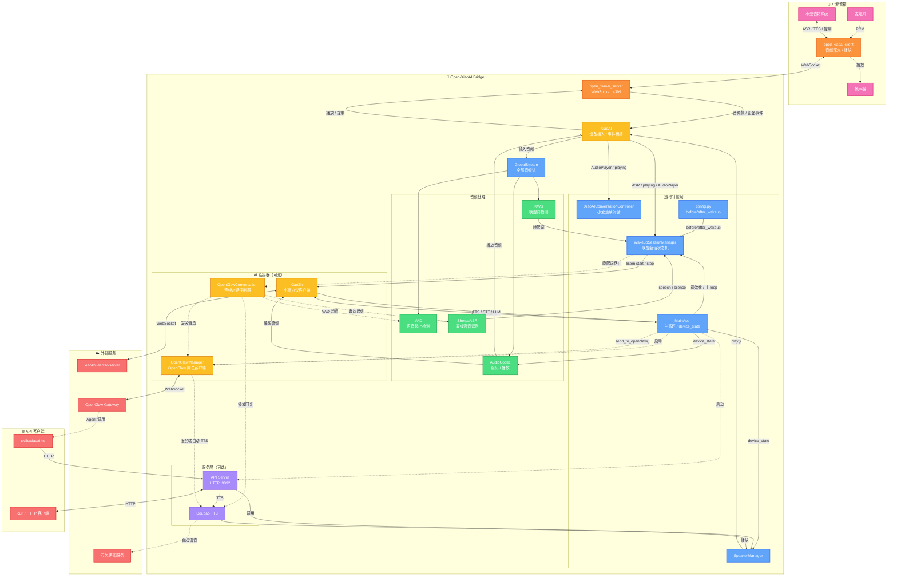

<div align="center">

# Open-XiaoAI Bridge

[](https://www.python.org/) [](https://www.rust-lang.org/) [](LICENSE) [](https://github.com/coderzc/open-xiaoai-bridge/stargazers) [](https://ghcr.io/coderzc/open-xiaoai-bridge)

[](https://github.com/coderzc/open-xiaoai-bridge/releases)

**小爱音箱与外部 AI 服务（小智 AI、OpenClaw）的桥接器**

打破小爱音箱的封闭生态，灵活接入多种 AI 服务，提供 HTTP API 实现远程控制。

[📺 演示视频](https://www.bilibili.com/video/BV1DHcBz1Ex7) · [📖 快速开始](#-快速开始) · [🦞 OpenClaw 集成](#-openclaw-集成) · [🔧 API 文档](#-api-server) · [🐛 常见问题](#-常见问题)

> 本项目由 [Open-XiaoAI](https://github.com/idootop/open-xiaoai) 的 `examples/xiaozhi/` 演进而来，已成为独立项目。

</div>

***

## ✨ 功能一览

| 功能                 | 说明                                                                             |
| ------------------ | ------------------------------------------------------------------------------ |
| 🦞 **OpenClaw 集成** | 接入 [OpenClaw](https://github.com/openclaw/openclaw)，支持连续对话，可选豆包 TTS 或小爱原生 TTS  |
| 🤖 **小智 AI 集成**    | 接入 [xiaozhi-esp32-server](https://github.com/xinnan-tech/xiaozhi-esp32-server) 实时音频流 |
| 🎙️ **自定义唤醒词**     | 支持中英文，不同唤醒词可路由到不同 AI 服务或不同 OpenClaw Agent                                      |
| 🧠 **多 Agent 路由**  | 一台音箱，多个唤醒词，每个唤醒词对应不同的 OpenClaw Agent Session，动态切换零开销                           |
| 💬 **连续对话**        | 多轮对话无需反复唤醒，喊"小爱同学"可随时打断                                                        |
| ⚡ **VAD + KWS**    | 语音活动检测前置，减少无效识别，更省电                                                            |
| 🌐 **HTTP API**    | 远程播放文字/音频、控制音箱                                                                 |
| 🧩 **模块化**         | 各功能独立开关，按需启用                                                                   |

***

## 🚀 快速开始

> **⚠️ 本项目仅包含服务端**，需要先在小爱音箱上安装 Client 端。

### 📦 前置步骤

1. **🔧 刷机** — 更新小爱音箱固件，开启 SSH
   - [刷机教程](https://github.com/coderzc/open-xiaoai/blob/main/docs/flash.md)
2. **🛠️ 音箱补丁程序安装 Client** — 在音箱上运行 Rust Client 端
   - [补丁程序安装教程](https://github.com/coderzc/open-xiaoai/blob/main/packages/client-rust/README.md)

### 🐳 Docker Compose（推荐）

```bash
# 下载配置文件
curl -O https://raw.githubusercontent.com/coderzc/open-xiaoai-bridge/main/config.py
curl -O https://raw.githubusercontent.com/coderzc/open-xiaoai-bridge/main/docker-compose.yml

# 按需修改 config.py 和 docker-compose.yml，然后启动
docker compose up -d
```

### 💻 本地编译

```bash
git clone https://github.com/coderzc/open-xiaoai-bridge.git
cd open-xiaoai-bridge

# 依赖: uv, Rust
# Linux 还需要: pkg-config, patchelf

# 启动（按需设置环境变量）
API_SERVER_ENABLE=1 XIAOZHI_ENABLE=1 OPENCLAW_ENABLED=1 ./scripts/start.sh
```

脚本会自动检查依赖、下载模型、生成关键词文件。也可以手动运行：

```bash
uv sync && uv run main.py
# CONFIG_PATH=/path/to/custom_config.py uv run main.py  # 自定义配置文件路径
```

### ⚙️ 环境变量

| 变量                  | 说明          | 默认值           |
| ------------------- | ----------- | ------------- |
| `XIAOZHI_ENABLE`    | 启用小智 AI     | 禁用            |
| `OPENCLAW_ENABLED`  | 启用 OpenClaw | 禁用            |
| `API_SERVER_ENABLE` | 启用 HTTP API | 禁用            |
| `API_SERVER_HOST`   | API 监听地址    | `127.0.0.1`   |
| `API_SERVER_PORT`   | API 监听端口    | `9092`        |
| `CONFIG_PATH`       | 自定义配置文件路径   | `./config.py` |
| `LOGLEVEL`          | 日志级别        | `INFO`        |

***

## 🏗️ 系统架构



### 工作流程

**🎯 小智唤醒与对话**

```
麦克风 → client → server → XiaoAI → GlobalStream → KWS/小爱 ASR
→ WakeupSessionManager → before_wakeup() → VAD speech/silence
→ XiaoZhi start/stop listening → xiaozhi-esp32-server
```

**🔄 小爱连续对话**

```
小爱 ASR / AudioPlayer 事件 → XiaoAIConversationController
→ 决定继续唤醒或退出
```

**🦞 OpenClaw 单次对话**

```
小爱指令 "让龙虾 xxx" → before_wakeup() → send_to_openclaw()
→ OpenClawManager → Gateway → Agent
→ 自动 TTS 播报 或 Agent 主动调用 xiaoai-tts skill
```

**🦞 OpenClaw 连续对话**

```
唤醒词 "你好龙虾" → WakeupSessionManager → OpenClawConversationController
→ 循环: VAD 检测语音 → SherpaASR 离线识别 → OpenClaw → TTS 播放
→ 说"退出"/"再见"退出
```

**🌐 远程控制**

```
curl POST /api/play/text → API Server → SpeakerManager → 小爱音箱
```

***

## 🔌 API Server

设置 `API_SERVER_ENABLE=1` 启用，默认端口 **9092**。

### 📡 端点列表

| 方法     | 路径                       | 说明           |
| ------ | ------------------------ | ------------ |
| `POST` | `/api/play/text`         | 播放文字（TTS）    |
| `POST` | `/api/play/url`          | 播放音频链接       |
| `POST` | `/api/play/file`         | 上传并播放音频文件    |
| `POST` | `/api/tts/doubao`        | 豆包 TTS 合成并播放 |
| `GET`  | `/api/tts/doubao_voices` | 获取可用音色列表     |
| `POST` | `/api/wakeup`            | 唤醒小爱音箱       |
| `POST` | `/api/interrupt`         | 打断当前播放       |
| `GET`  | `/api/status`            | 获取播放状态       |
| `GET`  | `/api/health`            | 健康检查         |

### 💡 使用示例

```bash
# 播放文字
curl -X POST http://localhost:9092/api/play/text \
  -H "Content-Type: application/json" \
  -d '{"text": "你好，我是小爱同学"}'

# 播放音频链接
curl -X POST http://localhost:9092/api/play/url \
  -H "Content-Type: application/json" \
  -d '{"url": "https://example.com/audio.mp3"}'

# 上传音频文件
curl -X POST http://localhost:9092/api/play/file \
  -F "file=@/path/to/audio.mp3"

# 豆包 TTS（可指定音色）
curl -X POST http://localhost:9092/api/tts/doubao \
  -H "Content-Type: application/json" \
  -d '{"text": "你好", "speaker_id": "zh_female_cancan_mars_bigtts"}'

# 打断播放
curl -X POST http://localhost:9092/api/interrupt
```

***

## 🦞 OpenClaw 集成

通过 [OpenClaw](https://github.com/openclaw/openclaw) 将小爱音箱变成你的 AI Agent 终端。

设置 `OPENCLAW_ENABLED=1` 启用

### 🎯 交互方式

#### 🎙️ 方式一：连续对话

用自定义唤醒词触发后进入多轮对话循环，全程本地处理，不依赖小爱 ASR：

```
唤醒词 "你好龙虾" → 提示音 → 你说话 → [VAD检测] → [本地ASR识别] → OpenClaw Agent → [TTS播报] → 提示音 → 你继续说 → ...
```

- 说"退出"或"再见"退出对话
- 小爱唤醒时自动打断 TTS 并退出
- 退出关键词可自定义

触发方式见下方[自定义唤醒词](#-自定义唤醒词)，`before_wakeup` 返回 `"openclaw"` 即进入连续对话。

#### 💬 方式二：单次对话（发送并播报）

通过小爱语音指令发送一条消息给 Agent，收到回复后自动 TTS 播报：

```python
# config.py 中的 before_wakeup
if "让龙虾" in text:
    await speaker.abort_xiaoai()
    await app.send_to_openclaw_and_play_reply(text.replace("让龙虾", ""))
    return None  # 框架不做额外处理
```

用户说"让龙虾查一下明天天气" → 打断小爱 → 发给 Agent → TTS 播报回复。

#### 📡 方式三：单次对话（Agent 自主播报）

只发送消息，不自动播报，由 Agent 调用 `xiaoai-tts` skill 自主播报：

```python
if "告诉龙虾" in text:
    await speaker.abort_xiaoai()
    await app.send_to_openclaw(text.replace("告诉龙虾", ""))
    return None
```

`send_to_openclaw()` 会自动追加 `rule_prompt_for_skill`（配置在 `config.py` 中），告诉 Agent 需要调用 skill 播报。适合 Agent 需要做复杂处理后再决定是否/如何播报的场景。

### 🎙️ 自定义唤醒词

唤醒词在 `config.py` 的 `wakeup.keywords` 中定义，支持中英文混合：

```python
"wakeup": {
    "keywords": [
        "你好小智",        # 中文
        "小智小智",
        "hi openclaw",    # 英文（全小写）
        "你好龙虾",
        "龙虾你好",
    ],
},
```

不同唤醒词可以路由到不同 AI 服务，在 `before_wakeup` 中根据文本内容判断：

```python
async def before_wakeup(speaker, text, source, app):
    if source == "kws":          # 唤醒词触发
        if "龙虾" in text:
            await speaker.play(text="龙虾来了")
            return "openclaw"    # → OpenClaw 连续对话
        if "小智" in text:
            await speaker.play(text="小智来了")
            return "xiaozhi"     # → 小智 AI
        return None              # → 不处理

    if source == "xiaoai":       # 小爱语音指令
        if text == "召唤龙虾":
            await speaker.abort_xiaoai()
            return "openclaw"
        if text == "召唤小智":
            await speaker.abort_xiaoai()
            return "xiaozhi"
    # 返回 None → 交给小爱原生处理
```

**返回值含义：** `"openclaw"` → 连续对话，`"xiaozhi"` → 小智 AI，`None` → 不处理（用户可自行调用 `app.send_to_openclaw()` 等方法）

### 🧠 多 Agent 路由 — 一个唤醒词，一个专属 Agent

`set_openclaw_session_key()` 让你在发送消息前动态切换目标 Agent Session，**无需重连，无性能开销**。结合自定义唤醒词，可以实现：

> **一台音箱，N 个专属 AI 助手，按名字呼唤谁，谁就来响应。**

```python
# config.py

AGENT_SESSIONS = {
    "龙虾": "agent:assistant:open-xiaoai-bridge",
    "小美": "agent:xiaomei:open-xiaoai-bridge",
    "管家": "agent:butler:open-xiaoai-bridge",
}

async def before_wakeup(speaker, text, source, app):
    if source == "kws":
        for keyword, session_key in AGENT_SESSIONS.items():
            if keyword in text:
                app.set_openclaw_session_key(session_key)  # 切换到对应 Agent
                await speaker.play(text=f"{keyword}来了")
                return "openclaw"                          # 进入连续对话

    if source == "xiaoai":
        for keyword, session_key in AGENT_SESSIONS.items():
            if f"召唤{keyword}" in text:
                app.set_openclaw_session_key(session_key)
                await speaker.abort_xiaoai()
                return "openclaw"
```

配合唤醒词配置：

```python
"wakeup": {
    "keywords": [
        "你好龙虾", "你好小美", "你好管家",
    ],
},
```

此后你说"**你好龙虾**"，进入的是龙虾 Agent 的上下文；说"**你好小美**"，进入的是小美 Agent 的上下文 —— 同一台音箱，完全隔离的多个 AI 人格。

退出时同样可以区分是哪个 Agent 结束了对话。`after_wakeup` 在 OpenClaw 退出时会收到 `session_key` 参数，取第二段即为 `agentId`：

```python
async def after_wakeup(speaker, source=None, session_key=None):
    if source == "openclaw":
        # session_key 格式：agent:<agentId>:<rest>，第二段即 agentId
        agent_id = session_key.split(":")[1] if session_key else None
        if agent_id == "assistant":
            await speaker.play(text="龙虾，再见")
        elif agent_id == "xiaomei":
            await speaker.play(text="小美，再见")
        elif agent_id == "butler":
            await speaker.play(text="管家，再见")
        else:
            await speaker.play(text="再见")
    if source == "xiaozhi":
        await speaker.play(text="小智，再见")
```

### 📝 rule_prompt — 约束 Agent 输出格式

有两个 prompt 配置，分别用于不同的播报场景：

| 配置 | 使用场景 | 自动追加位置 |
|------|---------|-------------|
| `rule_prompt` | 自动播放、连续对话 | `send_to_openclaw_and_play_reply()`、连续对话循环 |
| `rule_prompt_for_skill` | Agent 自主播报（方式三） | `send_to_openclaw()` |

**为什么需要两个 prompt？**

- **`rule_prompt`**：服务端会自动 TTS 播放，只需告诉 Agent 输出纯文字、控制字数
- **`rule_prompt_for_skill`**：服务端不会自动播放，需要告诉 Agent **主动调用 `xiaoai-tts` skill** 来播报

示例配置：

```python
"openclaw": {
    # 自动播放/连续对话用：约束输出格式
    "rule_prompt": "注意：将结果处理成纯文字版，不要返回任何 markdown 格式，也不要包含任何代码块，并将字数控制在300字以内",
    # Agent 自主播报用：告诉 Agent 需要调用 skill
    "rule_prompt_for_skill": "注意：这条消息是主人通过小爱音箱发送的，他看不到你回复的文字，调用 `xiaoai-tts` skill 播报出来。字数控制在300字以内",
}
```

不需要可以留空或不设置。

### 🎵 OpenClaw TTS 音色

`openclaw.tts_speaker` 支持两种值：

| 值          | 效果       | 说明                                                    |
| ---------- | -------- | ----------------------------------------------------- |
| `"xiaoai"` | 小爱原生 TTS | 零配置即可使用，音色由设备决定                                       |
| 豆包音色 ID    | 豆包语音合成   | 需配置 `tts.doubao` 的 `app_id` 和 `access_key`，详见 [TTS 章节](#-tts) |

### 🧩 Skills

`skills/xiaoai-tts/` — Agent 通过 HTTP API 控制小爱播放语音，支持小爱内置 TTS 和豆包 TTS。

📖 详见 [SKILL.md](skills/xiaoai-tts/SKILL.md)

***

## 🤖 小智 AI 集成

接入 [xiaozhi-esp32-server](https://github.com/xinnan-tech/xiaozhi-esp32-server)，使用小智 AI 的对话能力。

设置 `XIAOZHI_ENABLE=1` 启用

### 配置

```python
APP_CONFIG = {
    "xiaozhi": {
        "OTA_URL": "http://127.0.0.1:8003/xiaozhi/ota/",
        "WEBSOCKET_URL": "ws://127.0.0.1:8000/xiaozhi/v1/",
        "WEBSOCKET_ACCESS_TOKEN": "",  # 可选
        # "DEVICE_ID": "",  # 可选，默认自动生成
    },
}
```

### 使用

唤醒词触发后，`before_wakeup` 返回 `"xiaozhi"` 即进入小智对话流程。

详见[自定义唤醒词](#-自定义唤醒词)章节。

***

## ❓ 常见问题

### 🎙️ 唤醒词与连续对话

1. **模型文件在哪下载？**

    从 [releases](https://github.com/coderzc/open-xiaoai-bridge/releases/tag/vad-kws-asr-models) 下载 VAD + KWS + ASR 模型，解压到 `core/models/`。

    Docker 部署需挂载：

    ```yaml
    volumes:
      - ./models:/app/core/models
    ```

2. **如何打断 AI 的回答？**

    直接喊"小爱同学"即可打断小智或 OpenClaw 的回答。

3. **话没说完 AI 就开始回答？**

    调大 `min_silence_duration`：

    ```python
    APP_CONFIG = {
        "vad": {
            "min_silence_duration": 1000,  # 毫秒
        },
    }
    ```

4. **唤醒词没反应？**

    - 调低 `vad.threshold`（越小越灵敏，如 `0.05`）
    - 启动后需等约 30s 加载模型
    - 英文唤醒词用空格分开（如 `"open ai"`）
    - 换更易识别的唤醒词

### 🦞 OpenClaw

1. **首次连接出现 pairing required？**

    正常流程。保持服务在线，到 OpenClaw UI 批准设备：**Nodes → Devices → Approve**。

2. **容器重建后需要重新配对？**

    Docker 部署时挂载 `identity_path` 目录为持久化卷，否则设备身份丢失需重新配对：

    ```yaml
    # docker-compose.yml
    volumes:
      - ./openclaw:/app/openclaw
    ```

3. **session\_key 是什么？**

    告诉 Gateway 把消息路由到哪个 Agent Session，格式为冒号分隔的层级路径：

    ```
    agent:<agentId>:<rest>
    ```

    | 字段          | 说明                                 | 示例                          |
    | ----------- | ---------------------------------- | --------------------------- |
    | `agent`     | 固定前缀                               | `agent`                     |
    | `<agentId>` | OpenClaw 中配置的 Agent ID（默认为 `main`） | `main`、`assistant`          |
    | `<rest>`    | 会话标识，可自由命名，用于区分不同来源/场景             | `home`、`open-xiaoai-bridge` |

    常见格式举例：

    ```
    agent:main:open-xiaoai-bridge          # 默认值（本项目）
    agent:main:main                        # OpenClaw 原生默认主会话
    agent:assistant:open-xiaoai-bridge     # 指定其他 Agent
    agent:main:direct:alice                # 按用户隔离
    ```

4. **如何在运行时动态切换 session\_key？**

    每次唤醒触发 `before_wakeup` 之前，框架会自动将 `session_key` **重置为配置文件中的默认值**。因此：

    - 在 `before_wakeup` 中调用 `app.set_openclaw_session_key()` → 本次唤醒使用指定的 session
    - 不调用 → 自动使用配置文件中的 `openclaw.session_key`，不会沿用上一次的值

    这意味着你只需要在需要切换的路径里调用一次，不用担心"忘记重置"的问题。

    常见使用场景：

    **场景一：按唤醒词路由到不同 Agent**

    说"你好龙虾"唤醒龙虾 Agent，说"你好小美"唤醒小美 Agent：

    ```python
    AGENT_SESSIONS = {
        "龙虾": "agent:assistant:open-xiaoai-bridge",
        "小美": "agent:xiaomei:open-xiaoai-bridge",
        "管家": "agent:butler:open-xiaoai-bridge",
    }

    async def before_wakeup(speaker, text, source, app):
        if source == "kws":
            for keyword, session_key in AGENT_SESSIONS.items():
                if keyword in text:
                    app.set_openclaw_session_key(session_key)
                    await speaker.play(text=f"{keyword}来了")
                    return "openclaw"
    ```

    **场景二：每次唤醒生成独立 Session**

    每次对话互相隔离，适合以下情况：

    - "提问 → 回答"式交互，不需要 Agent 记住上下文
    - 长期使用同一 Session 导致 Agent 上下文堆积过长，影响响应质量和速度

    ```python
    import uuid

    def new_session_key():
        return f"agent:main:session-{uuid.uuid4().hex[:8]}"

    async def before_wakeup(speaker, text, source, app):
        if source == "kws" and "龙虾" in text:
            app.set_openclaw_session_key(new_session_key())
            await speaker.play(text="龙虾来了")
            return "openclaw"
    ```

5. **send\_to\_openclaw() 的返回值是什么？**

    - `send_to_openclaw(text)` → 成功返回 `run_id`（str），失败返回 `None`
    - `send_to_openclaw(text, wait_response=True)` → 成功返回回复文本，超时/失败返回 `None`
    - `send_to_openclaw_and_play_reply(text)` → 同上，但会自动 TTS 播放回复

### 🤖 小智 AI

1. **第一次运行提示验证码绑定设备？**

    打开小智 AI [管理后台](https://xiaozhi.me/)，根据提示创建 Agent 绑定设备。验证码会在终端打印或写入 `config.py`：

    ```python
    APP_CONFIG = {
        "xiaozhi": {
            "VERIFICATION_CODE": "首次登录时，验证码会在这里更新",
        },
    }
    ```

    绑定成功后可能需要重启应用。

2. **怎样使用自己部署的 xiaozhi-esp32-server？**

    修改 `config.py` 中的接口地址：

    ```python
    APP_CONFIG = {
        "xiaozhi": {
            "OTA_URL": "https://your-server/xiaozhi/ota/",
            "WEBSOCKET_URL": "wss://your-server/xiaozhi/v1/",
        },
    }
    ```

### 🎵 豆包 TTS

1. **如何配置豆包 TTS？**

    1. 开通[火山引擎语音合成服务](https://www.volcengine.com/docs/6561/1871062)，获取 App ID 和 Access Key（[接入文档](https://www.volcengine.com/docs/6561/1598757?lang=zh)）
    2. 填入配置：

    ```python
    "tts": {
        "doubao": {
            "app_id": "你的 App ID",
            "access_key": "你的 Access Key",
            "default_speaker": "zh_female_cancan_mars_bigtts",  # 默认音色，可选列表见下方
        }
    }
    ```

    音色列表：[火山引擎音色库](https://www.volcengine.com/docs/6561/1257544?lang=zh)

2. **如何使用声音复刻？**

    1. 在[火山引擎声音复刻控制台](https://console.volcengine.com/speech/new/experience/clone)上传 10-30 秒音频
    2. 训练完成后到[音色库](https://console.volcengine.com/speech/new/voices?projectName=default)复制音色 ID（格式 `S_xxxxxxxx`）
    3. **重要**：确保复刻音色与 `tts.doubao.app_id` 属于**同一个火山引擎项目**，否则无法使用
    4. 填入配置：

    ```python
    "tts": {
        "doubao": {
            "default_speaker": "S_xxxxxxxx",
        }
    }
    ```

3. **支持流式播放吗？怎么配置？**

    支持。推荐配置：

    ```python
    "tts": {
        "doubao": {
            "stream": True,           # 流式播放，首音延迟更低
            "audio_format": "pcm",    # 局域网推荐，首音更快
            # "audio_format": "auto", # 短文本 PCM，长文本 MP3
        }
    }
    ```

    - `pcm`：首音快，流式稳定，长文本总耗时可能更高
    - `mp3`：传输效率高，长文本更早结束
    - `auto`：折中方案，按文本长度自动选择

    冒烟测试（无需音箱，验证 TTS 是否正常）：

    ```bash
    python3 tests/test_tts_stream.py                                           # 测试流式 TTS 连通性
    python3 tests/test_tts_latency.py --formats mp3,pcm --rounds 3 --repeat 8  # 对比 mp3/pcm 延迟
    ```

***

## 📚 参考资源

| 资源              | 链接                                                                                                                                                                                                                                                       |
| --------------- | -------------------------------------------------------------------------------------------------------------------------------------------------------------------------------------------------------------------------------------------------------- |
| 🔧 刷机教程         | [刷机教程](https://github.com/idootop/open-xiaoai/blob/main/docs/flash.md)                                                                                                                                                                                   |
| 🛠️ Client 端安装  | [Client 端安装](https://github.com/idootop/open-xiaoai/blob/main/packages/client-rust/README.md)                                                                                                                                                            |
| 🎙️ 豆包 TTS 音色列表 | [火山引擎文档](https://www.volcengine.com/docs/6561/1257544)                                                                                                                                                                                                   |

***

<div align="center">

**Made with ❤️ by** **[coderzc](https://github.com/coderzc)**

如果这个项目对你有帮助，请给它一颗 ⭐️

</div>
