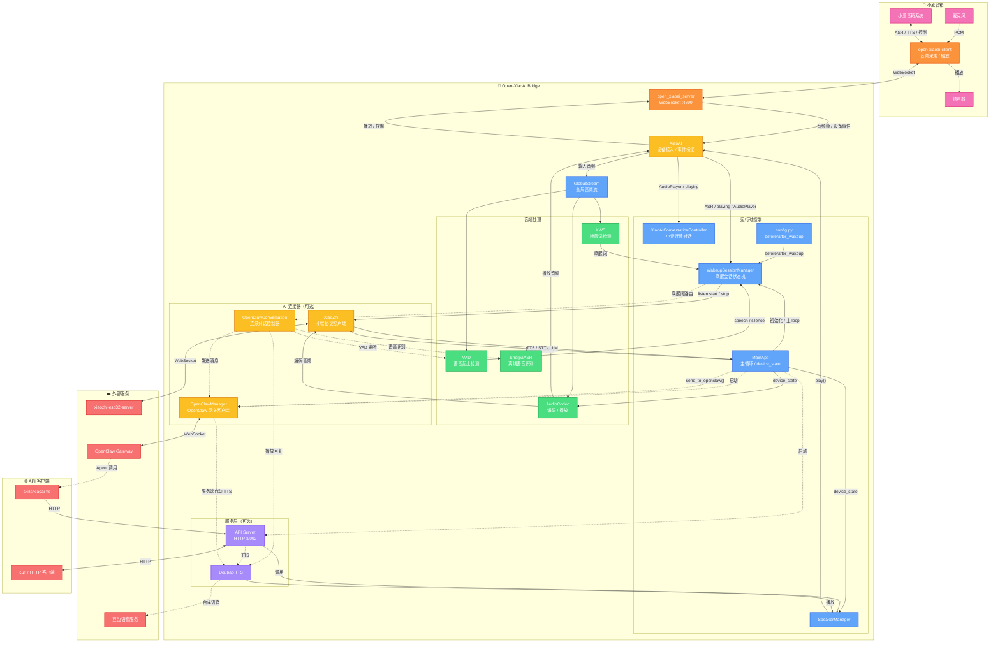

<div align="center">

# Open-XiaoAI Bridge

[](https://www.python.org/) [](https://www.rust-lang.org/) [](LICENSE) [](https://github.com/coderzc/open-xiaoai-bridge/stargazers) [](https://ghcr.io/coderzc/open-xiaoai-bridge)

[](https://github.com/coderzc/open-xiaoai-bridge/releases)

**小爱音箱与外部 AI 服务（小智 AI、OpenClaw）的桥接器**

打破小爱音箱的封闭生态，灵活接入多种 AI 服务，提供 HTTP API 实现远程控制。

[📺 演示视频](https://www.bilibili.com/video/BV1DHcBz1Ex7) · [📖 快速开始](#-快速开始) · [🔧 API 文档](#-api-server) · [🐛 常见问题](#-常见问题)

> 本项目由 [Open-XiaoAI](https://github.com/idootop/open-xiaoai) 的 `examples/xiaozhi/` 演进而来，已成为独立项目。

</div>

---

## 📋 目录

- [✨ 功能一览](#-功能一览)
- [🏗️ 系统架构](#️-系统架构)
- [🚀 快速开始](#-快速开始)
- [🔌 API Server](#-api-server)
- [🦞 OpenClaw 集成](#-openclaw-集成)
- [❓ 常见问题](#-常见问题)
- [📚 参考资源](#-参考资源)

---

## ✨ 功能一览

| 功能 | 说明 |
|------|------|
| 🦞 **OpenClaw 集成** | 接入 [OpenClaw](https://github.com/openclaw/openclaw)，支持连续对话，可选豆包 TTS 或小爱原生 TTS |
| 🤖 **小智 AI 集成** | 接入 [xiaozhi-esp32-server](https://github.com/xinnan-tech/xiaozhi-esp32-server) |
| 🎙️ **自定义唤醒词** | 支持中英文，不同唤醒词可路由到不同 AI 服务 |
| 💬 **连续对话** | 多轮对话无需反复唤醒，喊"小爱同学"可随时打断 |
| ⚡ **VAD + KWS** | 语音活动检测前置，减少无效识别，更省电 |
| 🌐 **HTTP API** | 远程播放文字/音频、控制音箱 |
| 🧩 **模块化** | 各功能独立开关，按需启用 |

---

## 🏗️ 系统架构



### 工作流程

**🎯 小智唤醒与对话**

```
麦克风 → client → server → XiaoAI → GlobalStream → KWS/小爱 ASR
→ WakeupSessionManager → before_wakeup() → VAD speech/silence
→ XiaoZhi start/stop listening → xiaozhi-esp32-server
```

**🔄 小爱连续对话**

```
小爱 ASR / AudioPlayer 事件 → XiaoAIConversationController
→ 决定继续唤醒或退出
```

**🦞 OpenClaw 代理（单次）**

```
小爱指令 "让龙虾 xxx" → before_wakeup() → send_to_openclaw()
→ OpenClawManager → Gateway → Agent
→ 自动 TTS 播报 或 Agent 主动调用 xiaoai-tts skill
```

**💬 OpenClaw 连续对话**

```
唤醒词 "你好龙虾" → WakeupSessionManager → OpenClawConversationController
→ 循环: VAD 检测语音 → SherpaASR 离线识别 → OpenClaw → TTS 播放
→ 说"退出"/"再见"退出
```

**🌐 远程控制**

```
curl POST /api/play/text → API Server → SpeakerManager → 小爱音箱
```

---

## 🚀 快速开始

> **⚠️ 本项目仅包含服务端**，需要先在小爱音箱上安装 Client 端。

### 📦 前置步骤

1. **🔧 刷机** — 更新小爱音箱固件，开启 SSH
   - [刷机教程](https://github.com/idootop/open-xiaoai/blob/main/docs/flash.md)

2. **🛠️ 安装 Client** — 在音箱上运行 Rust Client 端
   - [安装教程](https://github.com/idootop/open-xiaoai/blob/main/packages/client-rust/README.md)

### 🐳 Docker Compose（推荐）

```bash
# 下载配置文件
curl -O https://raw.githubusercontent.com/coderzc/open-xiaoai-bridge/main/config.py
curl -O https://raw.githubusercontent.com/coderzc/open-xiaoai-bridge/main/docker-compose.yml

# 按需修改 config.py 和 docker-compose.yml，然后启动
docker compose up -d
```

### 💻 本地编译

```bash
git clone https://github.com/coderzc/open-xiaoai-bridge.git
cd open-xiaoai-bridge

# 依赖: uv, Rust, Opus 动态库
# Linux 还需要: pkg-config, patchelf, libssl-dev

# 启动（按需设置环境变量）
API_SERVER_ENABLE=1 XIAOZHI_ENABLE=1 OPENCLAW_ENABLED=1 ./scripts/start.sh
```

脚本会自动检查依赖、下载模型、生成关键词文件。也可以手动运行：

```bash
uv sync && uv run main.py
```

自定义配置文件路径：

```bash
CONFIG_PATH=/path/to/custom_config.py uv run main.py
```

### ⚙️ 环境变量

| 变量 | 说明 | 默认值 |
|------|------|--------|
| `XIAOZHI_ENABLE` | 启用小智 AI | 禁用 |
| `OPENCLAW_ENABLED` | 启用 OpenClaw | 禁用 |
| `API_SERVER_ENABLE` | 启用 HTTP API | 禁用 |
| `API_SERVER_HOST` | API 监听地址 | `127.0.0.1` |
| `API_SERVER_PORT` | API 监听端口 | `9092` |
| `CONFIG_PATH` | 自定义配置文件路径 | `./config.py` |
| `LOGLEVEL` | 日志级别 | `INFO` |

---

## 🔌 API Server

设置 `API_SERVER_ENABLE=1` 启用，默认端口 **9092**。

### 📡 端点列表

| 方法 | 路径 | 说明 |
|------|------|------|
| `POST` | `/api/play/text` | 播放文字（TTS） |
| `POST` | `/api/play/url` | 播放音频链接 |
| `POST` | `/api/play/file` | 上传并播放音频文件 |
| `POST` | `/api/tts/doubao` | 豆包 TTS 合成并播放 |
| `GET` | `/api/tts/doubao_voices` | 获取可用音色列表 |
| `POST` | `/api/wakeup` | 唤醒小爱音箱 |
| `POST` | `/api/interrupt` | 打断当前播放 |
| `GET` | `/api/status` | 获取播放状态 |
| `GET` | `/api/health` | 健康检查 |

### 💡 使用示例

```bash
# 播放文字
curl -X POST http://localhost:9092/api/play/text \
  -H "Content-Type: application/json" \
  -d '{"text": "你好，我是小爱同学"}'

# 播放音频链接
curl -X POST http://localhost:9092/api/play/url \
  -H "Content-Type: application/json" \
  -d '{"url": "https://example.com/audio.mp3"}'

# 上传音频文件
curl -X POST http://localhost:9092/api/play/file \
  -F "file=@/path/to/audio.mp3"

# 豆包 TTS（可指定音色）
curl -X POST http://localhost:9092/api/tts/doubao \
  -H "Content-Type: application/json" \
  -d '{"text": "你好", "speaker_id": "zh_female_cancan_mars_bigtts"}'

# 打断播放
curl -X POST http://localhost:9092/api/interrupt
```

---

## 🦞 OpenClaw 集成

通过 [OpenClaw](https://github.com/openclaw/openclaw) 将小爱音箱变成你的 AI Agent 终端。

### 🎯 三种交互方式

#### 🎙️ 方式一：连续对话

用自定义唤醒词触发后进入多轮对话循环，全程本地处理，不依赖小爱 ASR：

```
唤醒词 "你好龙虾" → 提示音 → 你说话 → [VAD检测] → [本地ASR识别] → OpenClaw Agent → [TTS播报] → 提示音 → 你继续说 → ...
```

- 说"退出"或"再见"退出对话
- 小爱唤醒时自动打断 TTS 并退出
- 退出关键词可自定义

触发方式见下方[自定义唤醒词](#-自定义唤醒词)，`before_wakeup` 返回 `"openclaw"` 即进入连续对话。

#### 💬 方式二：单次对话（发送并播报）

通过小爱语音指令发送一条消息给 Agent，收到回复后自动 TTS 播报：

```python
# config.py 中的 before_wakeup
if "让龙虾" in text:
    await speaker.abort_xiaoai()
    await app.send_to_openclaw_and_play_reply(text.replace("让龙虾", ""))
    return None  # 框架不做额外处理
```

用户说"让龙虾查一下明天天气" → 打断小爱 → 发给 Agent → TTS 播报回复。

#### 📡 方式三：单次对话（Agent 自主播报）

只发送消息，不自动播报，由 Agent 自己决定何时、如何回复：

```python
if "告诉龙虾" in text:
    await speaker.abort_xiaoai()
    await app.send_to_openclaw(text.replace("告诉龙虾", ""))
    return None
```

适合 Agent 需要做复杂处理后再决定是否/如何播报的场景。

### 🎙️ 自定义唤醒词

唤醒词在 `config.py` 的 `wakeup.keywords` 中定义，支持中英文混合：

```python
"wakeup": {
    "keywords": [
        "你好小智",        # 中文
        "小智小智",
        "hi openclaw",    # 英文（全小写）
        "你好龙虾",
        "龙虾你好",
    ],
},
```

不同唤醒词可以路由到不同 AI 服务，在 `before_wakeup` 中根据文本内容判断：

```python
async def before_wakeup(speaker, text, source, app):
    if source == "kws":          # 唤醒词触发
        if "龙虾" in text:
            await speaker.play(text="龙虾来了")
            return "openclaw"    # → OpenClaw 连续对话
        if "小智" in text:
            await speaker.play(text="小智来了")
            return "xiaozhi"     # → 小智 AI
        return None              # → 不处理

    if source == "xiaoai":       # 小爱语音指令
        if text == "召唤龙虾":
            await speaker.abort_xiaoai()
            return "openclaw"
        if text == "召唤小智":
            await speaker.abort_xiaoai()
            return "xiaozhi"
    # 返回 None → 交给小爱原生处理
```

**返回值含义：** `"openclaw"` → 连续对话，`"xiaozhi"` → 小智 AI，`None` → 不处理（用户可自行调用 `app.send_to_openclaw()` 等方法）

### 📝 rule_prompt — 约束 Agent 输出格式

`rule_prompt` 会自动追加到每条发给 Agent 的消息末尾，用于约束输出格式。音箱场景只能播语音，需要告诉 Agent 不要返回 markdown、代码块等无法朗读的内容：

```python
"openclaw": {
    "rule_prompt": "注意：将结果处理成纯文字版，不要返回任何 markdown 格式，也不要包含任何代码块，并将字数控制在300字以内",
},
```

Agent 收到的实际消息：
```
查一下明天天气
注意：将结果处理成纯文字版，不要返回任何 markdown 格式，也不要包含任何代码块，并将字数控制在300字以内
```

不需要可以留空或不设置。

### 🔧 完整配置

```python
APP_CONFIG = {
    "wakeup": {
        "keywords": ["你好小智", "你好龙虾"],  # 自定义唤醒词
        "timeout": 20,                          # 静音多久后退出唤醒（秒）
        "before_wakeup": before_wakeup,         # 唤醒路由回调
        "after_wakeup": after_wakeup,           # 退出唤醒回调
    },
    "kws": {
        "keywords_score": 2.0,      # 唤醒词置信度加成（越高越难误触发）
        "keywords_threshold": 0.2,  # 检测阈值（越低越灵敏）
    },
    "openclaw": {
        "url": "ws://127.0.0.1:18789",                    # Gateway 地址
        "token": "your_token",                              # 认证令牌
        "session_key": "agent:main:open-xiaoai-bridge",     # 会话标识
        "identity_path": "/app/openclaw/identity/device.json",  # 设备身份文件
        "tts_speed": 1.0,                                  # 语速 (0.5-2.0)
        "tts_speaker": "xiaoai",                              # 音色
        "response_timeout": 120,                            # Agent 响应超时（秒）
        "exit_keywords": ["退出", "停止", "再见"],           # 连续对话退出关键词
        "rule_prompt": "注意：纯文字，不要 markdown，300字以内",  # 输出格式约束
    },
    "tts": {
        "doubao": {
            "app_id": "your_app_id",
            "access_key": "your_access_key",
            "default_speaker": "zh_female_vv_uranus_bigtts",
            "stream": True,           # 流式播放（推荐）
            "audio_format": "pcm",    # 局域网推荐，首音更快
        }
    },
}
```

### 🎵 OpenClaw TTS 音色

`openclaw.tts_speaker` 支持两种值：

| 值 | 效果 | 说明 |
|---|---|---|
| `"xiaoai"` | 小爱原生 TTS | 零配置即可使用，音色由设备决定 |
| 豆包音色 ID | 豆包语音合成 | 需配置 `tts.doubao` 的 `app_id` 和 `access_key`，支持 500+ 音色 |

豆包音色 ID 示例：`"zh_female_vv_uranus_bigtts"`（Vivi 2.0）、`"S_xxxxxxxx"`（克隆音色）。完整列表见[火山引擎文档](https://www.volcengine.com/docs/6561/1257544)。

不设置 `tts_speaker` 时，默认使用 `tts.doubao.default_speaker` 的豆包音色。

### 🐳 容器部署

挂载 `identity_path` 目录为持久化卷，否则容器重建后需要重新配对设备：

```yaml
# docker-compose.yml
volumes:
  - ./openclaw:/app/openclaw
```

首次连接时需到 OpenClaw UI 批准设备：**Nodes → Devices → Approve**

### 🧩 Skills

`skills/xiaoai-tts/` — Agent 通过 HTTP API 控制小爱播放语音，支持小爱内置 TTS 和豆包 TTS。

📖 详见 [SKILL.md](skills/xiaoai-tts/SKILL.md)

---

## ❓ 常见问题

### 🤖 小智 AI

**如何打断小智 AI 的回答？**  
直接召唤"小爱同学"即可打断。

**第一次运行提示验证码绑定设备？**  
打开小智 AI [管理后台](https://xiaozhi.me/)，根据提示创建 Agent 绑定设备。验证码会在终端打印或写入 `config.py`：

```python
APP_CONFIG = {
    "xiaozhi": {
        "VERIFICATION_CODE": "首次登录时，验证码会在这里更新",
    },
}
```

绑定成功后可能需要重启应用。

**怎样使用自己部署的 xiaozhi-esp32-server？**  
修改 `config.py` 中的接口地址：

```python
APP_CONFIG = {
    "xiaozhi": {
        "OTA_URL": "https://your-server/xiaozhi/ota/",
        "WEBSOCKET_URL": "wss://your-server/xiaozhi/v1/",
    },
}
```

**模型文件在哪下载？**  
从 [releases](https://github.com/coderzc/open-xiaoai-bridge/releases/tag/vad-kws-asr-models) 下载 VAD + KWS + ASR 模型，解压到 `core/models/`。

Docker 部署需挂载：

```yaml
volumes:
  - ./models:/app/core/models
```

### 🎙️ 唤醒词与连续对话

**话没说完 AI 就开始回答？**  
调大 `min_silence_duration`：

```python
APP_CONFIG = {
    "vad": {
        "min_silence_duration": 1000,  # 毫秒
    },
}
```

**唤醒词没反应？**  
- 调低 `vad.threshold`（越小越灵敏，如 `0.05`）
- 启动后需等约 30s 加载模型
- 英文唤醒词用空格分开（如 `"open ai"`）
- 换更易识别的唤醒词

### 🦞 OpenClaw

**首次连接出现 pairing required？**  
正常流程。保持服务在线，到 OpenClaw UI 批准设备：**Nodes → Devices → Approve**。容器部署注意事项见[容器部署](#-容器部署)。

**session_key 是什么？**  
告诉 Gateway 把消息路由到哪个 Agent 会话，对应 OpenClaw 中配置的 session 标识。

**send_to_openclaw() 的返回值是什么？**
- `send_to_openclaw(text)` → 成功返回 `run_id`（str），失败返回 `None`
- `send_to_openclaw(text, wait_response=True)` → 成功返回回复文本，超时/失败返回 `None`
- `send_to_openclaw_and_play_reply(text)` → 同上，但会自动 TTS 播放回复

**如何使用声音复刻？**
1. 在[火山引擎声音复刻控制台](https://console.volcengine.com/speech/new/experience/clone)上传 10-30 秒音频
2. 训练完成后到[音色库](https://console.volcengine.com/speech/new/voices?projectName=default)复制音色 ID（格式 `S_xxxxxxxx`）
3. 填入配置：

```python
"tts": {
    "doubao": {
        "default_speaker": "S_xxxxxxxx",
    }
}
```

### 🔊 TTS 流式播放

**支持流式播放吗？怎么配置？**

支持。推荐配置：

```python
"tts": {
    "doubao": {
        "stream": True,           # 流式播放，首音延迟更低
        "audio_format": "pcm",    # 局域网推荐，首音更快
        # "audio_format": "auto", # 短文本 PCM，长文本 MP3
    }
}
```

- `pcm`：首音快，流式稳定，长文本总耗时可能更高
- `mp3`：传输效率高，长文本更早结束
- `auto`：折中方案，按文本长度自动选择

无音箱冒烟测试：

```bash
python3 tests/test_tts_stream.py
python3 tests/test_tts_latency.py --formats mp3,pcm --rounds 3 --repeat 8
```

### 🔧 连接问题排查

1. 确认 Gateway / xiaozhi-esp32-server 已启动，地址端口可访问
2. 检查 `config.py` 中的 `url` / `token` 配置
3. 开启 DEBUG 日志：`LOGLEVEL=DEBUG`
4. 服务会自动指数退避重连，无需手动重启

---

## 📚 参考资源

| 资源 | 链接 |
|------|------|
| 📁 项目主页 | [github.com/coderzc/open-xiaoai-bridge](https://github.com/coderzc/open-xiaoai-bridge) |
| 🔧 刷机教程 | [刷机教程](https://github.com/idootop/open-xiaoai/blob/main/docs/flash.md) |
| 🛠️ Client 端安装 | [Client 端安装](https://github.com/idootop/open-xiaoai/blob/main/packages/client-rust/README.md) |
| 🎵 Opus 安装说明 | [Opus 安装说明](https://github.com/huangjunsen0406/py-xiaozhi/blob/3bfd2887244c510a13912c1d63263ae564a941e9/documents/docs/guide/01_%E7%B3%BB%E7%BB%9F%E4%BE%9D%E8%B5%96%E5%AE%89%E8%A3%85.md#2-opus-%E9%9F%B3%E9%A2%91%E7%BC%96%E8%A7%A3%E7%A0%81%E5%99%A8) |
| 🎙️ 豆包 TTS 音色列表 | [火山引擎文档](https://www.volcengine.com/docs/6561/1257544) |

---

<div align="center">

**Made with ❤️ by [coderzc](https://github.com/coderzc)**

如果这个项目对你有帮助，请给它一颗 ⭐️

</div>
