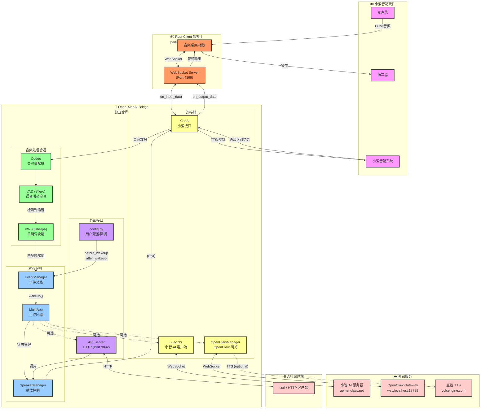

# Open-XiaoAI Bridge

小爱音箱与外部 AI 服务（小智 AI、OpenClaw 等）的桥接器。

打破小爱音箱的封闭生态，灵活接入多种 AI 服务（小智 AI、OpenClaw 或自定义 Agent），提供 HTTP API 实现远程控制。致力于成为智能音箱与 AI 服务之间的标准桥接层。

> 本项目由 [Open-XiaoAI](https://github.com/idootop/open-xiaoai) 的 `examples/xiaozhi/` 演进而来，在保留小智 AI 接入能力的基础上，新增 OpenClaw 集成、HTTP API Server 等功能，未来将成为独立项目发展。

## 功能特性

- 🤖 **小爱音箱接入小智 AI**（可选）
- 🧩 **模块化设计** - 可灵活启用/禁用各功能模块
- 💬 **连续对话和中途打断**
- 🎙️ **自定义唤醒词**（中英文）和提示语
- 🎨 **支持自定义消息处理**，方便个人定制
- 🌐 **HTTP API Server** - 支持远程播放文字/音频/TTS
- 🔄 **连续对话模式** - 小爱原生支持多轮对话，无需反复唤醒
- ⚡ **VAD + KWS 唤醒** - 语音活动检测前置，避免唤醒词长期监听，更省电
- 🔗 **OpenClaw 集成** - 支持将消息转发到外部 AI Agent 服务
- 🎛️ **模块化设计** - 通过环境变量灵活控制服务启停

## 系统架构



### 工作流程说明

1. **唤醒流程（KWS → 小智 AI）**
   ```
   麦克风 → Rust Client → WebSocket → XiaoAI → Codec → VAD → KWS → EventManager →
   before_wakeup()回调 → MainApp → XiaoZhi → 小智 AI 服务器
   ```

2. **小爱指令 → OpenClaw (TTS 播放)**
   ```
   小爱语音 → "让龙虾 xxx" → XiaoAI → before_wakeup() →
   send_to_openclaw() → OpenClawManager → OpenClaw Gateway → AI Agent
   ↓
   Doubao TTS 合成 ← 获取回复文本 ← OpenClawManager
   ↓
   SpeakerManager → 小爱音箱播放
   ```

3. **远程控制（HTTP API）**
   ```
   curl POST /api/play/text → API Server → SpeakerManager → XiaoAI →
   Rust Client → 小爱音箱播放
   ```

## 快速开始

> [!NOTE]
> 继续下面的操作之前，你需要先在小爱音箱上启动运行 Rust 补丁程序 [👉 教程](https://github.com/coderzc/open-xiaoai/blob/main/packages/client-rust/README.md)

首先，克隆仓库代码到本地。

```shell
# 克隆代码
git clone https://github.com/coderzc/open-xiaoai-bridge.git

# 进入当前项目目录
cd open-xiaoai-bridge
```

然后把 `config.py` 文件里的配置修改成你自己的。

```python
APP_CONFIG = {
    "wakeup": {
        # 自定义唤醒词列表（英文字母要全小写）
        "keywords": [
            "豆包豆包",
            "你好小智",
            "hi siri",
        ],
        # 静音多久后自动退出唤醒（秒）
        "timeout": 20,
        # 唤醒前回调：处理收到的消息，返回 True 才唤醒小智
        "before_wakeup": before_wakeup,
        # 退出唤醒回调
        "after_wakeup": after_wakeup,
    },
    "vad": {
        # 语音检测阈值（0-1，越小越灵敏）
        "threshold": 0.10,
        # 最小语音时长（ms）
        "min_speech_duration": 250,
        # 最小静默时长（ms），调大可以避免 AI 过早回答
        "min_silence_duration": 500,
    },
    "xiaozhi": {
        "OTA_URL": "https://api.tenclass.net/xiaozhi/ota/",
        "WEBSOCKET_URL": "wss://api.tenclass.net/xiaozhi/v1/",
        # "WEBSOCKET_ACCESS_TOKEN": "",  # （可选）一般用不到
        # "DEVICE_ID": "xx:xx:xx:xx:xx:xx",  # （可选）默认自动生成
        # "VERIFICATION_CODE": "",  # 首次登录时，验证码会自动更新在这里
    },
    "xiaoai": {
        # 开启小爱原生连续对话模式
        "continuous_conversation_mode": True,
        # 退出连续对话的关键词
        "exit_command_keywords": ["停止", "退下", "退出", "下去吧"],
        # 开启连续对话的指令
        "continuous_conversation_keywords": ["开启连续对话", "启动连续对话", "我想跟你聊天"],
    },
    "openclaw": {
        "url": "ws://localhost:18789",  # OpenClaw WebSocket 地址
        "token": "",  # 认证令牌（如果需要）
        "session_key": "main",  # 会话标识
    },
    "tts": {
        "doubao": {
            # 豆包语音合成 API 配置
            # 文档: https://www.volcengine.com/docs/6561/1598757
            "app_id": "",
            "access_key": "",
            # 默认音色: https://www.volcengine.com/docs/6561/1257544
            "default_speaker": "zh_female_xiaohe_uranus_bigtts",
        }
    },
}
```

### Docker 运行

镜像托管在 GitHub Container Registry。

#### 基础模式（仅小爱音箱）

```shell
docker run -it --rm -p 4399:4399 -v $(pwd)/config.py:/app/config.py ghcr.io/coderzc/open-xiaoai-bridge:latest
```

#### 启用 API Server（9092 端口）

```shell
docker run -it --rm \
  -p 4399:4399 \
  -p 9092:9092 \
  -e API_SERVER_ENABLE=1 \
  -v $(pwd)/config.py:/app/config.py \
  ghcr.io/coderzc/open-xiaoai-bridge:latest
```

#### 启用小智 AI

```shell
docker run -it --rm \
  -p 4399:4399 \
  -e XIAOZHI_ENABLE=1 \
  -v $(pwd)/config.py:/app/config.py \
  ghcr.io/coderzc/open-xiaoai-bridge:latest
```

#### 启用 OpenClaw

```shell
docker run -it --rm \
  -p 4399:4399 \
  -e OPENCLAW_ENABLED=true \
  -e OPENCLAW_URL=ws://your-server:18789 \
  -e OPENCLAW_TOKEN=your_token \
  -v $(pwd)/config.py:/app/config.py \
  ghcr.io/coderzc/open-xiaoai-bridge:latest
```

#### 全功能模式（小爱 + 小智 AI + API Server + OpenClaw）

```shell
docker run -it --rm \
  -p 4399:4399 \
  -p 9092:9092 \
  -e XIAOZHI_ENABLE=1 \
  -e API_SERVER_ENABLE=1 \
  -e OPENCLAW_ENABLED=true \
  -e OPENCLAW_URL=ws://your-server:18789 \
  -e OPENCLAW_TOKEN=your_token \
  -v $(pwd)/config.py:/app/config.py \
  ghcr.io/coderzc/open-xiaoai-bridge:latest
```

### 编译运行

为了能够正常编译运行该项目，你需要安装以下依赖环境/工具：

- uv：https://github.com/astral-sh/uv
- Rust: https://www.rust-lang.org/learn/get-started
- [Opus](https://opus-codec.org/): 自行询问 AI 如何安装动态链接库，或参考[这篇文章](https://github.com/huangjunsen0406/py-xiaozhi/blob/3bfd2887244c510a13912c1d63263ae564a941e9/documents/docs/guide/01_%E7%B3%BB%E7%BB%9F%E4%BE%9D%E8%B5%96%E5%AE%89%E8%A3%85.md#2-opus-%E9%9F%B3%E9%A2%91%E7%BC%96%E8%A7%A3%E7%A0%81%E5%99%A8)

```bash
# 安装 Python 依赖
uv sync --locked

# 编译运行（仅小爱音箱模式）
uv run main.py

# 开启小智 AI 连接
XIAOZHI_ENABLE=1 uv run main.py

# 开启 API Server
API_SERVER_ENABLE=1 uv run main.py

# 开启 OpenClaw 集成
OPENCLAW_ENABLED=true uv run main.py

# 全功能模式（小爱 + 小智 AI + API Server + OpenClaw）
XIAOZHI_ENABLE=1 API_SERVER_ENABLE=1 OPENCLAW_ENABLED=true uv run main.py
```

### 环境变量配置

| 环境变量 | 说明 | 示例 |
|---------|------|------|
| `XIAOZHI_ENABLE` | 连接小智 AI 服务 | `XIAOZHI_ENABLE=1` |
| `API_SERVER_ENABLE` | 开启 HTTP API 服务（端口 9092） | `API_SERVER_ENABLE=1` |
| `OPENCLAW_ENABLED` | 启用 OpenClaw 集成 | `OPENCLAW_ENABLED=true` |
| `OPENCLAW_URL` | OpenClaw WebSocket 地址 | `OPENCLAW_URL=ws://localhost:18789` |
| `OPENCLAW_TOKEN` | OpenClaw 认证令牌 | `OPENCLAW_TOKEN=your_token` |
| `OPENCLAW_SESSION_KEY` | OpenClaw 会话标识 | `OPENCLAW_SESSION_KEY=main` |

## API Server 集成

当设置 `API_SERVER_ENABLE=1` 启动时，会开启 HTTP API 服务（默认端口 9092），支持以下接口：

### API 端点

| 方法 | 路径 | 说明 |
|------|------|------|
| POST | `/api/play/text` | 播放文字（TTS） |
| POST | `/api/play/url` | 播放音频链接 |
| POST | `/api/play/file` | 上传并播放音频文件 |
| POST | `/api/tts/doubao` | 豆包 TTS 合成并播放 |
| GET | `/api/tts/doubao_voices` | 获取可用音色列表 |
| POST | `/api/wakeup` | 唤醒小爱音箱 |
| POST | `/api/interrupt` | 打断当前播放 |
| GET | `/api/status` | 获取播放状态 |
| GET | `/api/health` | 健康检查 |

### 使用示例

```bash
# 播放文字
curl -X POST http://localhost:9092/api/play/text \
  -H "Content-Type: application/json" \
  -d '{"text": "你好，我是小爱同学"}'

# 播放音频链接
curl -X POST http://localhost:9092/api/play/url \
  -H "Content-Type: application/json" \
  -d '{"url": "https://example.com/audio.mp3"}'

# 上传音频文件
curl -X POST http://localhost:9092/api/play/file \
  -F "file=@/path/to/audio.mp3"

# 豆包 TTS
curl -X POST http://localhost:9092/api/tts/doubao \
  -H "Content-Type: application/json" \
  -d '{"text": "你好，这是豆包语音合成", "speaker": "zh_female_cancan_mars_bigtts"}'

# 打断当前播放
curl -X POST http://localhost:9092/api/interrupt
```

## OpenClaw 集成

支持通过 [OpenClaw](../openclaw/README.md) 将消息转发到外部 AI Agent 服务。

### 配置 OpenClaw

在 `config.py` 中配置 OpenClaw 连接信息：

```python
APP_CONFIG = {
    "openclaw": {
        "url": "ws://localhost:18789",  # OpenClaw WebSocket 地址
        "token": "",  # 认证令牌（如果需要）
        "session_key": "main",  # 会话标识
        "tts_enabled": False,  # 启用 Doubao TTS 播放 OpenClaw 回复
        "blocking_playback": True,  # TTS 播放是否阻塞等待完成 (默认 True)
        "tts_speaker": "zh_female_cancan_mars_bigtts",  # 可选：自定义音色，不设置则使用 tts.doubao.default_speaker
    },
}
```

或通过环境变量配置：

```bash
OPENCLAW_ENABLED=true OPENCLAW_URL=ws://your-server:18789 OPENCLAW_TOKEN=xxx uv run main.py
```

### 在 before_wakeup 中使用

编辑 `config.py`，通过 `app.send_to_openclaw()` 发送消息：

```python
async def before_wakeup(speaker, text, source, xiaozhi, xiaoai, app):
    if source == "xiaoai":
        if text.startswith("让龙虾"):
            # 发送给 OpenClaw，不唤醒小智
            await app.send_to_openclaw(text.replace("让龙虾", ""))
            return False
    return True
```

## 常见问题

### 小智 AI 相关

#### Q：回答太长了，如何打断小智 AI 的回答？

直接召唤"小爱同学"，即可打断小智 AI 的回答 ;)

#### Q：第一次运行提示我输入验证码绑定设备，如何操作？

第一次启动对话时，会有语音提示使用验证码绑定设备。请打开你的小智 AI [管理后台](https://xiaozhi.me/)，然后根据提示创建 Agent 绑定设备即可。验证码消息会在终端打印，或者打开你的 `config.py` 文件查看。

```python
APP_CONFIG = {
    "xiaozhi": {
        "VERIFICATION_CODE": "首次登录时，验证码会在这里更新",
    },
    # ... 其他配置
}
```

PS：绑定设备成功后，可能需要重启应用才会生效。

#### Q：怎样使用自己部署的 [xiaozhi-esp32-server](https://github.com/xinnan-tech/xiaozhi-esp32-server) 服务？

如果你想使用自己部署的 [xiaozhi-esp32-server](https://github.com/xinnan-tech/xiaozhi-esp32-server)，请更新 `config.py` 文件里的接口地址，然后重启应用。

```python
APP_CONFIG = {
    "xiaozhi": {
        "OTA_URL": "https://2662r3426b.vicp.fun/xiaozhi/ota/",
        "WEBSOCKET_URL": "wss://2662r3426b.vicp.fun/xiaozhi/v1/",
    },
    # ... 其他配置
}
```

#### Q：有时候话还没说完 AI 就开始回答了，如何优化？

你可以调大 `config.py` 配置文件里的 `min_silence_duration` 参数，然后重启应用 / Docker 试试看。

```python
APP_CONFIG = {
    "vad": {
        # 最小静默时长（ms）
        "min_silence_duration": 1000,
    },
    # ... 其他配置
}
```

#### Q：对话的时候，文字识别不是很准？

文字识别结果取决于你的小智 AI 服务器端的语音识别方案，与本项目无关。

#### Q：唤醒词一直没有反应？

如果唤醒词还是不敏感，可以先调低 `vad.threshold`，然后重启应用 / Docker 试试看。

```python
APP_CONFIG = {
    "vad": {
        # 语音检测阈值（0-1，越小越灵敏）
        "threshold": 0.05,
    },
    # ... 其他配置
}
```

另外，应用 / Docker 刚刚启动时需要加载模型文件，比较耗时一些，可以等 30s 之后再试试看。

如果是英文唤醒词，可以尝试将最小发音用空格分开，比如：'openai' 👉 'open ai'

PS：如果还是不行，建议更换其他更易识别的唤醒词。

#### Q: 我想自己编译运行，模型文件在哪里下载？

由于 ASR 相关模型文件体积较大，并未直接提交在 git 仓库中，你可以在 Open-XiaoAI release 中下载 [VAD + KWS 相关模型](https://github.com/coderzc/open-xiaoai/releases/tag/vad-kws-models)，然后解压到 `core/models` 路径下即可。

### API Server 相关

#### Q：如何远程控制小爱音箱播放文字？

当 API Server 启用后（`API_SERVER_ENABLE=1`），可以通过 HTTP 接口远程控制：

```bash
curl -X POST http://localhost:9092/api/play/text \
  -H "Content-Type: application/json" \
  -d '{"text": "你好，我是小爱同学"}'
```

更多 API 接口请参考上方 **API Server 集成** 章节。

### OpenClaw 相关

#### Q：如何配置 OpenClaw 连接？

在 `config.py` 中配置 OpenClaw 连接信息：

```python
APP_CONFIG = {
    "openclaw": {
        "url": "ws://localhost:18789",
        "token": "your_token",  # 如果 OpenClaw 需要认证
        "session_key": "main",
    },
}
```

或通过环境变量：

```bash
OPENCLAW_ENABLED=true OPENCLAW_URL=ws://your-server:18789 OPENCLAW_TOKEN=xxx python main.py
```

#### Q：如何通过 OpenClaw 发送指令？

编辑 `config.py` 中的 `before_wakeup` 回调函数，将特定指令转发给 OpenClaw：

```python
async def before_wakeup(speaker, text, source, xiaozhi, xiaoai, app):
    if source == "xiaoai":
        if text.startswith("让龙虾"):
            await app.send_to_openclaw(text.replace("让龙虾", ""))
            return False  # 不唤醒小智
    return True
```

#### Q：如何让 OpenClaw 的回复用 Doubao TTS 播放？

启用 `tts_enabled` 配置后，OpenClaw 的 AI 回复会自动使用 Doubao TTS 合成语音并播放：

```python
APP_CONFIG = {
    "openclaw": {
        "url": "ws://localhost:18789",
        "token": "your_token",
        "session_key": "main",
        "tts_enabled": True,  # 启用 TTS 播放回复
    },
    "tts": {
        "doubao": {
            "app_id": "your_app_id",
            "access_key": "your_access_key",
            "default_speaker": "zh_female_xiaohe_uranus_bigtts",
        }
    },
}
```

注意：需要先配置 `tts.doubao` 的 API 凭证才能正常使用。
```

#### Q：如何为 OpenClaw 设置不同的 TTS 音色？

默认情况下，OpenClaw 使用 `tts.doubao.default_speaker` 的音色。你可以通过 `tts_speaker` 配置项为 OpenClaw 设置独立的音色：

```python
APP_CONFIG = {
    "openclaw": {
        "tts_enabled": True,
        "tts_speaker": "zh_female_cancan_mars_bigtts",  # OpenClaw 专用音色
    },
    "tts": {
        "doubao": {
            "default_speaker": "zh_female_xiaohe_uranus_bigtts",  # 默认音色
        }
    },
}
```

可用音色列表请参考 `/api/tts/doubao_voices` 接口或 [Doubao 官方文档](https://www.volcengine.com/docs/6561/1257544)。

#### Q：TTS 播放是阻塞还是非阻塞的？

默认使用**阻塞方式**（`blocking_playback: True`），即等待音频播放完成才返回。如果你想改为非阻塞方式，可以设置：

```python
APP_CONFIG = {
    "openclaw": {
        "tts_enabled": True,
        "blocking_playback": False,  # 非阻塞播放
    },
}
```

**区别**：
- **阻塞模式**（默认）：播放完成后才继续执行，不会被其他音频打断
- **非阻塞模式**：启动播放后立即返回，可能被后续的音频指令打断
